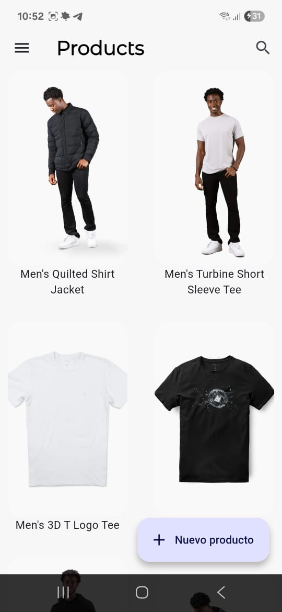
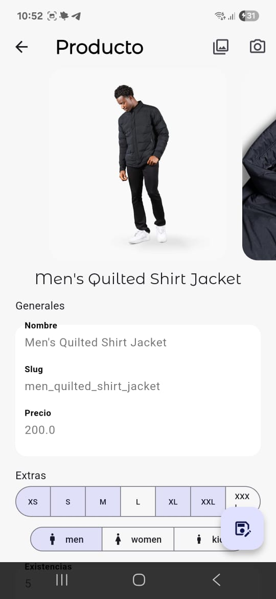
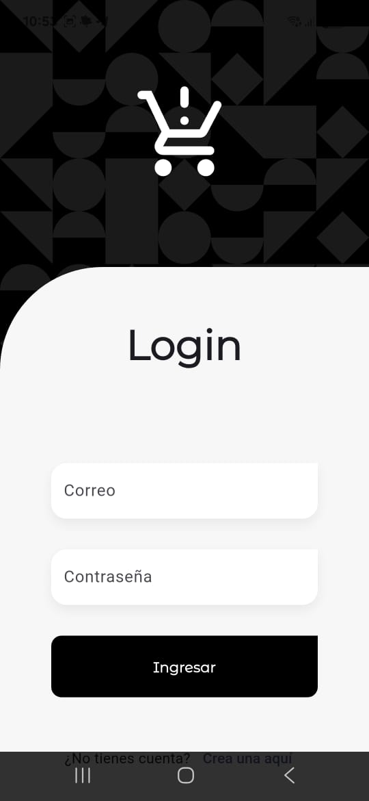

# 🛒 Teslo App - CRUD Autenticado con Flutter

Welcome to Teslo App, a Flutter application that serves as a client for a product management system. It allows users to authenticate, view an inventory, and perform CRUD (Create, Read, Update, Delete) operations on products.

This project is built using Riverpod for state management, GoRouter for navigation, and integrates with a backend to handle business logic and data persistence. It follows a Clean Architecture-inspired approach to keep the codebase scalable and maintainable.

## Features

- **User Authentication**: A secure login system to protect access.
- **Product Management**: Find movies quickly with the search delegate.
  - View a paginated list of products.
  - Create new products with detailed information.
  - Update existing product data.
- **Image Handling**: Use the device's camera or gallery to add and update product images.
- **Token-based Sessions**: Utilizes JSON Web Tokens (JWT) to manage user sessions and secure API requests.
- **Centralized State Management**: Implemented with Riverpod for efficient and predictable state handling.
- **Robust Navigation**: Uses **GoRouter** for declarative and powerful routing.

## ⚠️ Under Development
Please note that some features are still a work in progress:
- The **new user registration** screen is not yet finished.*
- **Product search functionality** has not been implemented.
- The ability to **delete photos** from an existing product is unavailable.

## Screenshots
 



## Backend Setup

This application requires an instance of the TesloShop backend to function. The backend runs on NestJS and uses a PostgreSQL database, all managed within Docker containers.

### Requirements

- **Docker Desktop**: Make sure the Docker service is running.
- **Database GUI (Recommended)**: A tool like [TablePlus](https://tableplus.com/) is recommended to view the database tables and data.

### Installation & Setup

1. **Download the Backend**: Get the necessary files from the official repository.

    [Teslo Backend - Nest RestServer](https://github.com/Klerith/flutter-backend-teslo)

2. **Configure Environment**:

    - In the backend project folder, clone the `.env.template` file and rename the copy to `.env`.
    - No modifications are needed for local development.

 3. **Start the Services**: Run the following command to build and start the Docker containers (backend and database).
    ```
    docker compose up -d
    ```
4. **Seed the Database**: Once the services are running, populate the database with seed data by navigating to the following URL in your browser:

    - [http://localhost:3000/api/seed](http://localhost:3000/api/seed)

5. **API Documentation**: You can find the available API endpoints documentation here:

    - [http://localhost:3000/api](http://localhost:3000/api)

6. **View Database (Optional)**:

    - Open TablePlus or your preferred GUI.
    -Create a new PostgreSQL connection with the credentials found in the `docker-compose.yml` file of the backend project. This will allow you to see the tables (`users`, `products`, etc.) and the data generated by the seed.

## Flutter App Requirements 

- Flutter SDK (version 3.0.0 or higher)
- Dart (version 2.17.0 or higher)
- Backend running

## Flutter App Installation

1. **Clone the repository**:
   ```bash
   git clone https://github.com/lauritaila/teslo_app
2. **Navigate to the project directory**:
   ```bash
   cd teslo_app
3. **Set up environment variables**:
    - Copy `.env.template` and rename it to `.env`
    - Update the `.env` file with the IP address of your backend. For local development, this will be your machine's local IP.
    ```bash
    # Example for local development
    API_URL=http://192.168.1.10:3000/api
    ```
4. **Install dependencies**:
   ```bash
   flutter pub get
5. **Run the app**:
   ```bash
   flutter run

## Project Structure (Clean Architecture Inspired)

The app follows a basic structure inspired by Clean Architecture, separating concerns into layers:

```
teslo_app/
lib/
├── config/                 # App-wide configuration (router, theme)
│
├── features/
│   ├── auth/               # Authentication feature
│   │   ├── domain/
│   │   ├── infrastructure/
│   │   └── presentation/
│   │
│   ├── products/           # Products feature
│   │   ├── domain/
│   │   ├── infrastructure/
│   │   └── presentation/
│   │
│   └── shared/             # Shared widgets and infrastructure
│       ├── infrastructure/
│       └── widgets/
│
└── main.dart               # Application entry point

```

### How the Layers Work Together:

1. **`Domain Layer`**: Contains the core business logic, entities (models), and repository contracts (interfaces). It is completely independent of other layers.
2. **`Infrastructure Layer`**: Implements the contracts defined in the domain layer. It handles data from external sources (like the REST API) and contains repository implementations, data models (DTOs), and mappers.
3. **`Presentation Layer`**: The UI layer, which includes screens, widgets, and state management (Providers). It depends on the domain layer to interact with the business logic.

---

This structure ensures a clean separation of concerns, making the app easier to maintain, test, and scale.

## Dependencies

- **UI & Animation**:
    - [image_picker](https://pub.dev/packages/image_picker): For selecting and taking images.
    - [google_fonts](https://pub.dev/packages/google_fonts): Custom fonts.
    - [flutter_staggered_grid_view](https://pub.dev/packages/flutter_staggered_grid_view): Masonry layout.
- **State Management & Navigation**:
    - [flutter_riverpod](https://pub.dev/packages/flutter_riverpod): State management.
    - [go_router](https://pub.dev/packages/go_router): Navigation routing.
- **Data & Networking:**:
    - [flutter_riverpod](https://pub.dev/packages/dio): HTTP client.
    - [shared_preferences](https://pub.dev/packages/shared_preferences): For simple local storage.
- **Helpers & Environment**:
    - [formz](https://pub.dev/packages/formz): For environment variables.
    - [flutter_dotenv](https://pub.dev/packages/flutter_dotenv):  For form validation.

## Contributing
Contributions are welcome! If you have any ideas to improve the app, please open an issue or submit a pull request.
